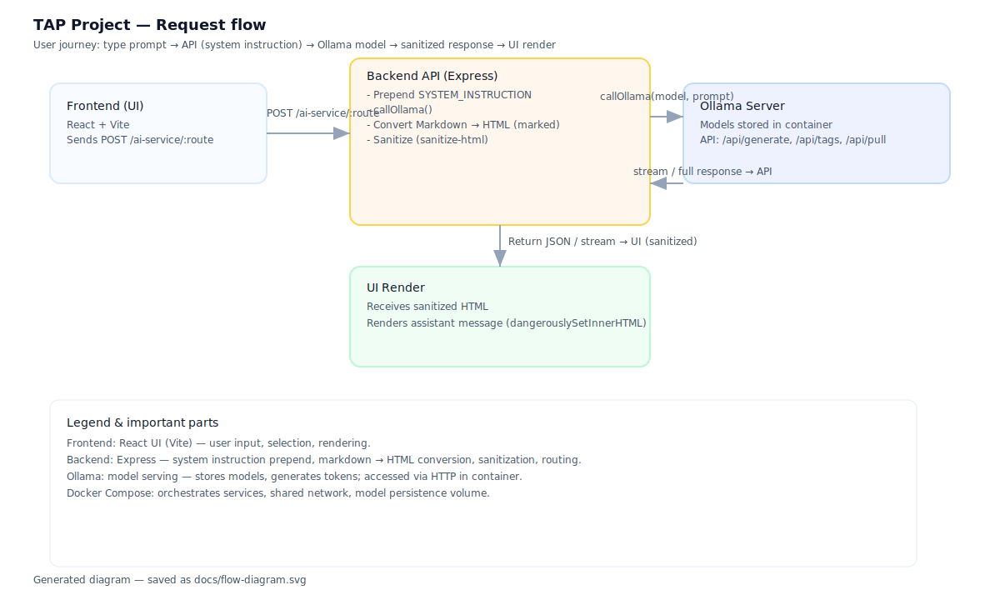

 # TAP Project — Local AI & API

A minimal demo: a React/Vite chat UI that posts prompts to an Express API which proxies requests to an Ollama model server (Docker). The backend prepends a system instruction, calls Ollama, sanitizes model output, and returns JSON or a token stream to the UI.

## Quick overview
- Frontend: React + Vite (`ui/`) — chat UI, streaming client, Abort/timeout handling.
- Backend: Node.js + Express (`api/`) — proxies to Ollama, sanitizes output with `marked` + `sanitize-html`.
- Models: Ollama container (HTTP API on port 11434 in compose).
- Orchestration: `docker-compose.yml` runs `ollama`, `api`, and `ui` for local development.

## Run locally
From project root:

```bash
docker compose up -d --build
```

Open the UI: http://localhost:8080

View logs:

```bash
docker compose logs api --tail 200
docker compose logs ollama --tail 200
```

Stop:

```bash
docker compose down
```

## API usage
- Endpoint: `POST /ai-service/:route`
- Body: `{ "prompt": "..." }`
- Routes map to models (configured via compose env: `MODEL_A`, `MODEL_B`, and `AUTO`).

Example:

```http
POST /ai-service/a
Content-Type: application/json

{ "prompt": "Tell me a joke." }
```

## Diagram
<!-- keep only the committed SVG file, not the Mermaid source -->


## Key notes
- Backend prepends a SYSTEM instruction, calls Ollama, converts Markdown → HTML, and sanitizes HTML server-side (allowlist: `b`, `i`, `p`, `br`).
- Streaming: backend proxies Ollama token streams; the UI uses a ReadableStream reader and AbortController for stop/timeouts.
- Security: never render unsanitized HTML — server-side sanitization is required before the UI uses `dangerouslySetInnerHTML`.

## Troubleshooting
- `MODEL not found`: list models inside Ollama: `curl http://localhost:11434/api/tags` and update `MODEL_A`/`MODEL_B`.
- Streaming issues: check browser console and `docker compose logs api` for parsing errors.

## Important files
 # TAP Project — Local AI & API

A minimal demo: a React/Vite chat UI that posts prompts to an Express API which proxies requests to an Ollama model server (Docker). The backend prepends a system instruction, calls Ollama, sanitizes model output, and returns JSON or a token stream to the UI.

## Quick overview
- Frontend: React + Vite (`ui/`) — chat UI, streaming client, Abort/timeout handling.
- Backend: Node.js + Express (`api/`) — proxies to Ollama, sanitizes output with `marked` + `sanitize-html`.
- Models: Ollama container (HTTP API on port 11434 in compose).
- Orchestration: `docker-compose.yml` runs `ollama`, `api`, and `ui` for local development.

## Run locally
From project root:

```bash
docker compose up -d --build
```

Open the UI: http://localhost:8080

View logs:

```bash
docker compose logs api --tail 200
docker compose logs ollama --tail 200
```

Stop:

```bash
docker compose down
```

## API usage
- Endpoint: `POST /ai-service/:route`
- Body: `{ "prompt": "..." }`
- Routes map to models (configured via compose env: `MODEL_A`, `MODEL_B`, and `AUTO`).

Example:

```http
POST /ai-service/a
Content-Type: application/json

{ "prompt": "Tell me a joke." }
```

## Diagram
<!-- keep only the committed SVG file, not the Mermaid source -->


## Key notes
- Backend prepends a SYSTEM instruction, calls Ollama, converts Markdown → HTML, and sanitizes HTML server-side (allowlist: `b`, `i`, `p`, `br`).
- Streaming: backend proxies Ollama token streams; the UI uses a ReadableStream reader and AbortController for stop/timeouts.
- Security: never render unsanitized HTML — server-side sanitization is required before the UI uses `dangerouslySetInnerHTML`.

## Troubleshooting
- `MODEL not found`: list models inside Ollama: `curl http://localhost:11434/api/tags` and update `MODEL_A`/`MODEL_B`.
- Streaming issues: check browser console and `docker compose logs api` for parsing errors.

## Important files
- `api/src/index.js` — proxy, stream parsing, sanitization.
- `ui/src/App.jsx` — streaming client, timeouts, UI.
- `ui/src/App.css` — styles.
- `docs/flow-diagram.svg` — request flow diagram (used above).

If you'd like the diagram embedded as a PNG in the README or quick-start badges added, I can add that next.
  1. Selects model based on route: `a` -> MODEL_A, `b` -> MODEL_B, `auto` -> heuristic.
  2. Prepend a `SYSTEM_INSTRUCTION` to the prompt to bias output towards plain text and HTML emphasis (no Markdown).
  3. Call Ollama (`/api/generate`) with the composed prompt.
  4. Convert returned Markdown to HTML using `marked`, then sanitize HTML using `sanitize-html` allowing only `<b>`, `<i>`, `<p>`, `<br>`.
  5. Return `{ route, model, output, latency_ms }` to client.

Example request (client):

```http
POST /ai-service/a HTTP/1.1
Content-Type: application/json

{ "prompt": "Tell me a joke." }
```

Example response (server):

```json
{ "route":"a", "model":"gemma3:1b", "output":"<p>Here is a joke <b>...</b></p>", "latency_ms": 420 }
```

## Running locally (common commands)

From project root:

```bash
# Build and start (rebuild images)
docker compose up -d --build

# View logs
docker compose logs api --tail 200
docker compose logs ollama --tail 200
docker compose logs model-ui --tail 200

# Stop
docker compose down
```

Open the UI at: http://localhost:8080 (note: the UI is served by nginx at host port 8080 in this compose).

## Important operational notes

- Models available: Use `curl http://localhost:11434/api/tags` to list installed models inside the Ollama container. The API configuration expects `MODEL_A` and `MODEL_B` names to match what Ollama exposes.
- Changing default models: update `docker-compose.yml` env or provide runtime env when starting compose: `MODEL_B=deepseek-r1:8b docker compose up -d --build`.
- Pulling models: Use `curl -X POST http://localhost:11434/api/pull -H 'Content-Type: application/json' -d '{"name":"llama3.2:3b"}'` or `docker compose exec ollama ollama pull llama3.2:3b`.

## Streaming vs non-streaming (short)

- Non-streaming (current default): API waits for complete model output before returning JSON. Simpler to implement, but perceived latency can be higher for long outputs.
- Streaming: API and frontend proxy token stream and render partial output as it arrives. Improves perceived latency (TTFB) and reduces API memory buffering. More complex: requires streaming proxying, backpressure handling, incremental sanitization and cancellation support.

If you want streaming implemented, recommended approaches:
- Fetch ReadableStream in the browser and proxy from API using `axios` with `responseType: 'stream'` or `undici`.
- Or use SSE (Server-Sent Events) for simpler one-way streaming.

## Security and sanitization

- We intentionally sanitize model output server-side with `sanitize-html` allowing a minimal set of tags. The UI renders assistant HTML with `dangerouslySetInnerHTML` only because the server sanitizes it first. NEVER render unsanitized HTML from untrusted sources.
- If you later add authentication, ensure you protect the API and the Ollama endpoint accordingly.

## Troubleshooting

- If API logs show `MODEL not found` (404), run `curl http://localhost:11434/api/tags` to see the model names Ollama exposes and match `MODEL_B` accordingly.
- If UI shows stale content after edits, perform a hard refresh or restart the `ui` container.

## Important files to check

- `api/src/index.js` — the proxy logic, system instruction, and sanitization are here.
- `ui/src/App.jsx` — the chat UI (sends prompts, shows messages).
- `ui/src/App.css` — UI styles and layout (the card is centered here).
- `docker-compose.yml` — environment, model defaults, and service definitions.


